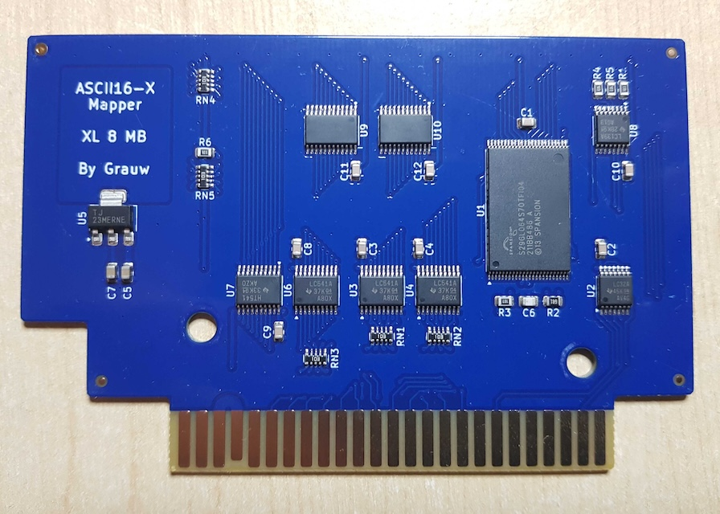

# ASCII-X mapper project

Copyright 2024 Laurens Holst

## Project information

Open and low-cost FlashROM cartridge design for large cartridge games.

  * Author: Laurens Holst <laurens@grauw.nl>
  * Site: <https://www.grauw.nl/projects/ascii-x/>
  * Flash tool: <https://www.grauw.nl/projects/ascii-x-flash/>
  * Source: <https://github.com/grauw/ascii-x>
  * Documentation: [ASCII16-X specification](ASCII16-X.md)
  * Support: <https://www.msx.org/forum/msx-talk/development/ascii-x-flashrom-cartridge>
  * License: MIT

The ASCII16-X cartridge for MSX is an extension to the common ASCII16 mapper.
It provides extended memory capacity, FlashROM memory which allows for
persisting save games, mirroring of pages and bank select registers across the
entire address space, and is backwards compatible with existing software.

The primary goal of this project is to provide the MSX community with open
hardware implementations of ASCII mappers with these extended capabilities,
using only commonly available parts, and aimed at optimising manufacturing
simplicity and cost. As such, this project also contains actual cartridge
hardware implementations built with plain logic ICs.

The following cartridge designs are currently available:

  * ASCII16-X Mapper Extra Large (XL) 8 MB

These designs are made with KiCad 9.0.2. Their dimensions target the Overrich
cartridge cases. Board width is kept under 10 cm to allow for cheap PCB
fabrication. The surface mount components are also all on a single side for
cheaper PCB assembly, as well as simplified hand-soldering using a stencil.

## Media

## Mapper specifications

### ASCII16-X

  * Flash ROM memory with commands for per-sector erasing and programming.
  * Extended addressable capacity up to 64 MB (design provided for 8 MB).
  * Two 16K mapper pages, mirrored to the full address range.
  * Two bank selection registers accessible in all pages.
  * Mostly backwards compatible with ASCII16.

See [ASCII16-X mapper specification](ASCII16-X.md) for more information.

## Cartridge hardware designs

### ASCII16-X Mapper Extra Large (XL) 8 MB

This design is suitable for large ROM cartridges of either 4 MB or 8 MB.

Since FlashROMs above 2 MB are only available in 3.3V versions, it requires
circuitry for voltage translation between the 5V MSX bus and the 3.3V FlashROM.

The design utilises an Infineon 8 MB FlashROM which is currently the most
economical choice, though it also supports smaller capacities. The board has
3 logic ICs for the mapper logic, and 5 additional logic ICs as well as an LDO
for the voltage level translation.

The design files can be found in the `ASCII16-X Mapper XL` folder.

### Considerations for other designs

Given enough interest, an ASCII16 design for capacities up to 2 MB could be
created. This design can be simplified by omitting the buffers for voltage
translation, due to FlashROM chips up to 2 MB being available in 5V versions.

There are no plans for an ASCII16-X design larger than 8 MB. This would need
two additional logic ICs or a CPLD or FPGA. At the moment there seems to be no
immediate need for it, the current max capacity should be sufficient for now.

Given enough interest, an ASCII8 design for capacities up to 2 MB could also be
created. This requires two additional register ICs, but does not need buffers
for voltage translation due to FlashROM chips up to 2 MB being available for 5V.

There are no plans for an ASCII8-X design larger than 2 MB. Due to the necessary
extra circuitry for mapper registers and 3.3V level translation, it becomes
difficult to fit that many chips on the board and keep the costs and complexity low,
without resorting to an FPGA. If software makers need access to such large
amounts of memory ASCII16-X is the more logical choice.

The designs use SMD chip footprints with relatively fine pin pitches, which
requires some skill when hand-soldering. The logic ICs use TSSOP footprints
(pin pitch: 0.65 mm), and the FlashROMs use 48-pin TSOP-I (pin pitch: 0.5 mm).
For the larger capacities this is pretty much required, however for smaller
capacities the designs could be altered to use SOIC and PLCC footprints
(pin pitch: 1.27 mm) or even DIP (pin pitch: 2.54 mm).

## PCB fabrication & assembly

Bare and assembled boards can be ordered from online services such as
[PCBWay](https://www.pcbway.com/). It is recommended to use the assembly service
offered by the factory, since their assembly fee is very affordable, and they
may also be able to source components at better prices.

### Shared community project

For convenience the designs are available as PCBWay community projects, batches
of (assembled) boards can be ordered directly from them and part of their fee
will be donated to yours truly. Feel free to use that service if you wish.

  * [ASCII16-X Mapper XL 8 MB - PCBWay](https://www.pcbway.com/project/shareproject/ASCII16_X_Mapper_XL_8_MB_36fd58c4.html)

### Cost considerations

The PCB fabrication and assembly cost depends on many factors, such as batch
size, component cost, PCB manufacturer fees, tariffs, and several other factors.
However as a rough indication of what to expect; a small batch of around 20 XL
units produced in March 2024 cost around US$ 15 apiece (ex. VAT). An estimation
of the cost for a batch of 200 units amounts to about US$ 10 apiece (ex. VAT).

Of course for the complete package of a final product there are also additional
costs to consider, such as cartridge cases, box, manual, etc.

### Recommended PCB fabrication settings

  * Board type: Single pieces
  * Different designs: 1
  * Size: 99.8 x 65 cm
  * Layers: 2 layers
  * Material: FR-4
  * FR4-TG: TG 150-160
  * Thickness: 1.6
  * Min track/spacing: 6/6 mil
  * Min hole size: 0.3 mm
  * Edge connector: Yes
    * Beveling: Yes (45°)
  * Finish: Immersion gold (ENIG)
    * Thickness of immersion gold: 1U"
  * Surface finish: Immersion gold (ENIG)
  * Thickness of immersion gold: 1U"
  * Via process: Tenting vias
  * Finished copper: 1 oz Cu
  * Remove product no.: Yes

For prototyping in low quantities you can get boards cheaply by selecting the
HASL finish, however for distribution you should use ENIG finish even if the PCB
cost is higher (roughly 1.5x depending on quantity). Gold plated EDGE fingers
are very expensive, so that option is not recommended, ENIG is sufficient.

### Recommended assembly service settings

  * Assembly side: Top side
  * Contains sensitive components/parts: No
  * Accept substitutes made in China: No

When you get a quotation for the assembly, it’s worth cross-checking the parts
cost against prices on Digikey or Mouser. You can ask to procure parts from
those distributors if there is a significant difference, especially for the
expensive parts like the FlashROM.
